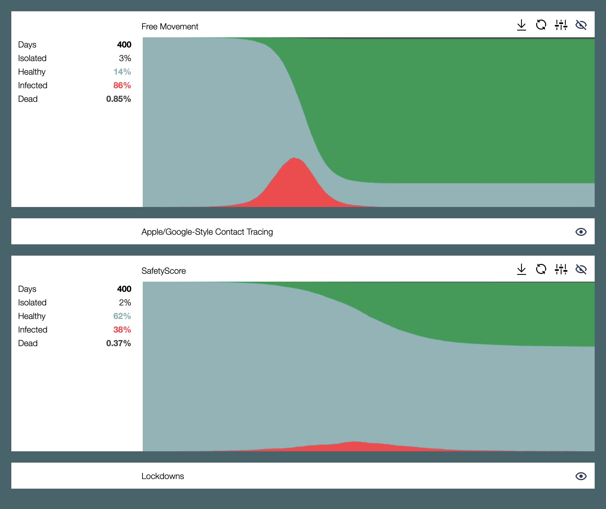

# SafetyScore Simulation

We've built a stochastic ICM (Individual Contact Model) to explicitly represent
individuals within a population so that we can best understand the factors that
affect infectious disease spread.



If you're interested in collaborating, please join us on Slack:

* https://safetyscore.app/join

### Model Parameters

The model supports a broad range of parameters that can be changed from within
the web interface:

```typescript
{
  // the portion of people who have an Apple/Google-style Contact Tracing app installed
  appleGoogleInstalled: 0.6,

  // distribution of the number of clusters for a person
  clusterCount: new ZipfDistribution({min: 1, max: 20}),

  // distribution of the number of "primary" members in a cluster
  clusterSize: new PoissonDistribution({mean: 20, min: 1, max: 50}),

  // the portion of the population that can be tested
  dailyTestCapacity: 0.005,

  // number of days to run the simulation
  days: 400,

  // the likelihood of a SafetyScore user being okay with visiting a non-gate-kept cluster
  exposedVisit: 0.1,

  // likelihood of dying once infected
  fatalityRisk: 0.01,

  // daily likelihood of someone in the whole population getting infected from outside the population
  foreignImports: 0.06,

  // the portion of clusters who gate-keep access via SafetyScore
  gatekeptClusters: 0.6,

  // the SafetyScore level needed to access a gate-kept cluster
  gatekeptThreshold: 50,

  // distribution of the group size within a cluster for a single period
  groupSize: new PoissonDistribution({mean: 2.5, min: 2, max: 20}),

  // distribution of the number of people in a household [not used yet]
  household: new PoissonDistribution({mean: 2.1, min: 1, max: 6}),

  // distribution of illness days after incubation
  illness: new NormalDistribution({mean: 10.5, min: 7}),

  // distribution of the days of natural immunity
  immunity: new NormalDistribution({mean: 238, min: 0}),

  // likelihood of someone getting infected during a single contact
  infectionRisk: 0.01,

  // likelihood of someone installing SafetyScore for visiting a foreign gate-kept cluster
  installForeign: 0,

  // whether the app is installed for the whole household during initial installations
  installHousehold: false,

  // isolate whole household if someone self-isolates
  isolateHousehold: true,

  // number of days a person should self-isolate
  isolationDays: 21,

  // likelihood of a self-isolating person staying at home for any given period during the day
  isolationEffectiveness: 0.9,

  // likelihood of a notified person self-isolating
  isolationLikelihood: 0.9,

  // likelihood of an isolated person staying at home for any given period during lockdown
  isolationLockdown: 0.9,

  // the SafetyScore level below which one is notified to self-isolate and test
  isolationThreshold: 50,

  // likelihood of a symptomatic individual self-isolating
  isolationSymptomatic: 1,

  // portion of the population who will not be isolated during lockdown
  keyWorkers: 0.16,

  // the number of infected people, below which a lockdown could end
  lockdownEnd: 5,

  // number of days the number of infected people must be below "lockdownEnd" before lockdown ends
  lockdownEndWindow: 14,

  // the number of infected people which will trigger a lockdown
  lockdownStart: 15,

  // format of the generated output file, can be "json" or "png"
  outputFormat: "png",

  // total number of people
  population: 10000,

  // number of days before becoming infectious
  preInfectiousDays: 3,

  // number of days of being infectious before possibly becoming symptomatic
  preSymptomaticInfectiousDays: 3,

  // portion of clusters which are public
  publicClusters: 0.15,

  // the portion of people who have SafetyScore installed at the start
  safetyScoreInstalled: 0,

  // a multiplicative weighting factor for second-degree tokens
  secondDegreeWeight: 1,

  // likelihood of a symptomatic person self-attesting
  selfAttestation: 0,

  // the portion of people who become symptomatic
  symptomatic: 0.2,

  // the distribution of the delay days between symptomatic/notified and testing
  testDelay: new PoissonDistribution({mean: 2, min: 1, max: 10}),

  // test all key workers
  testKeyWorkers: false,

  // likelihood of a key worker getting tested
  testKeyWorker: 0.1,

  // likelihood of a person getting themselves tested if notified
  testNotified: 0.9,

  // likelihood of a person getting themselves tested if symptomatic
  testSymptomatic: 0.6,

  // portion of people who have long-lasting immunity from vaccination
  vaccinated: 0,

  // likelihood of visiting a "foreign" cluster during a period
  visitForeignCluster: 0.2,

  // likelihood of visiting a public cluster when visiting a foreign cluster
  visitPublicCluster: 0.15,
}
```

### Model Overview

At the start of each run:

* The system places individuals into households based on sampled household
  sizes.

* Clusters are created based on sampled clusters sizes and individuals are
  assigned as members. These clusters are intended to represent different spaces
  where people might interact, e.g. offices, schools, family gatherings,
  friends, shops, train stations, etc.

* Some clusters are classified as "public", and people might have a higher
  chance of visiting these depdending on the values for `publicClusters` and
  `visitPublicCluster`.

Each day of the simulation starts at home:

* Individuals will have a chance of getting infected by anyone who is infectious
  within their household, or through foreign importation.

* Infected individuals, depending on whether they are symptomatic or not, may
  choose to self-isolate and submit to a test. Test requests go onto a queue and
  are processed based on the `dailyTestingCapacity`.

* Once test results are processed, if any apps are used, they will get
  appropriately updated. This might result in others getting notified, prompting
  them to self-isolate or get tested.

Each day of the simulation is split up into eight periods, and during each of
these periods:

* People will visit a cluster. This will either be one of their own clusters,
  i.e. ones that they are members of, or a "foreign" cluster.

* Within each cluster, the currently present individuals are put into groups
  based on sampled group sizes.

* Interaction is then assumed across all members of any particular group. If
  anyone is infected, they will then have an `infectionRisk` chance of infecting
  others within the group.

* If an app is being used, it will keep track of contacts that have been made —
  assuming the other party also has the app installed.

### Simulation Modes

The system currently supports four distinct modes:

* `FREE_MOVEMENT` — In this mode, movement is only restricted for `symptomatic`
  individuals who are within the `isolationSymptomatic` threshold.

* `APPLE_GOOGLE` — In this mode, certain members of the population have a
  contact tracing app installed based on the Apple/Google Exposure Notification
  API. Once a symptomatic individual with the app tests positive, this will
  trigger notifications to their contacts who are then prompted to isolate, and
  get tested.

* `SAFETYSCORE` — In this mode, certain members of the population have the
  SafetyScore app installed. Once a symptomatic individual with the app tests
  positive, this will trigger deposits of viral tokens to their direct contacts
  and second-degree contacts.

  The various tokens are then aggregated to produce a SafetyScore for everyone.
  If the score drops below a certain threshold, then the individual is prompted
  to isolate, and get tested. Based on `gatekeptClusters`, some clusters may
  also limit access to people with a good enough score.

* `LOCKDOWN` — In this mode, a lockdown is triggered once `lockdownStart` number
  of individuals have been infected on any particular day. This will then
  restrict movement for everyone except key workers. Lockdown will only end once
  the number of daily infections drops below `lockdownEnd` for at least
  `lockdownEndWindow` days.

### Future Considerations

This work is just the start. We will be evolving this to support:

* Environmental factors and the related effects on transmission.

* Locale-specific demographics and their relationship to risk and productivity.

* Distinct cluster types such as schools, hospitals, offices, etc.

* Better representations of each of the methods.

* Varying temporal contact structures based on social behaviour.

* Macroscopic mobility structures such as airports.

* Varying risk based on healthcare capacity.

* Varying levels of exposure during contact based on environmental factors.

* Varying the effectiveness of contact detection based on environmental factors.

We would love your help on any of these fronts.

### Limitations

* The number of days that can be represented on the graph is limited by the
  viewer's screen width. This is due to the fact that we restrict the graph
  drawing to whole integer values so as to avoid the antialiasing done by
  browser engines.

* The interface hasn't yet been adapted to mobile browsers.

### License

All of the code in this repository written by the authors has been released
under the Apache 2.0 License.

—  
Enjoy, tav &lt;tav@espians.com&gt;
